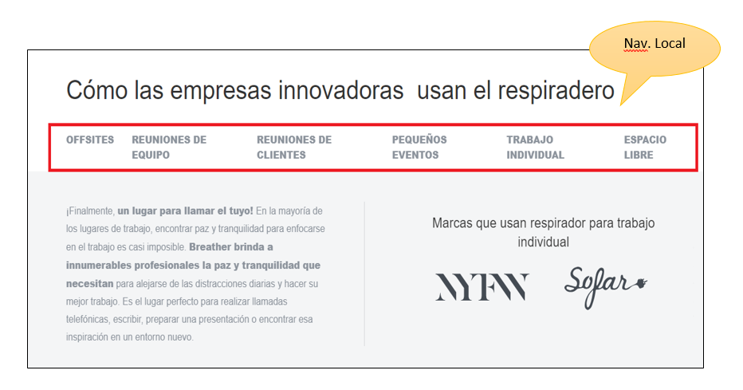

# SISTEMAS DE NAVEGACION
En este trabajo realice un análisis de los sistemas de navegación .

El Analisis fue realizado en estas tres páginas:

•	Breather

•	Github

•	Medium

Donde se encontraron los siguientes sistemas de navegación:

+ **Navegación Global**: Es la navegación del site.

+ **Navegación Local**: Es la navegación localizada a una página o vista.
+	**Navegación en Línea**: Son. links de referencia

+	**Navegación Contextual**: Es la navegación acorde al contexto

+	**Navegación Facetada**: Es la navegación a través de filtros no editables

+	**Navegación Filtrada**: En este tipo de navegación le damos al usuario
 todos los resultados de la búsqueda

 [NAVEGACION](BREATHER.docx)

  

  

  

    

  

  

  

  

  

  
